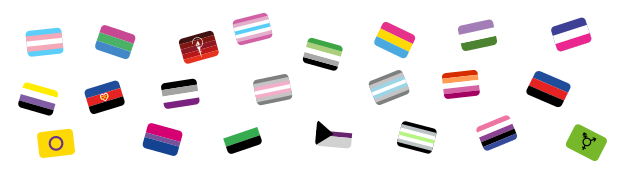

<div align="center">

# twemoji-flags




Pride flags in the style of Twemojis.
</div>

## Emojicons
| Flag | Name | Filename |
|------|------|----------|
|                   | Agender Flag          | `agender_flag.svg` |
|                 | Aromantic Flag        | `aromantic_flag.svg` |
|                   | Asexual Flag          | `asexual_flag.svg` |
|                  | Bisexual Flag         | `bi_flag.svg` |
|                     | Ceres Flag            | `ceres_flag.svg` |
|                   | Demiboy Flag          | `demiboy_flag.svg` |
|                  | Demigirl Flag         | `demigirl_flag.svg` |
|                | Demisexual Flag       | `demi_flag.svg` |
|  | Femboy Flag | `femboy_flag.svg` |
|               | Genderfluid Flag      | `genderfluid_flag.svg` |
|  | Genderqueer NB 1 Flag | `genderqueer_nb1_flag.svg` |
|     | Genderqueer NB Flag   | `genderqueer_nb_flag.svg` |
|   | Heterosexual Flag     | `hetero_flag.svg` |
|            | Intersexual Flag      | `intersexualtiy_flag.svg` |
|                   | Lesbian Flag          | `lesbian_flag.svg` |
|                  | Neutrois Flag         | `neutrois_flag.svg` |
|                 | NB Flag               | `nb_flag.svg` |
|                | Pansexual Flag        | `pan_flag.svg` |
|             | Polyamorie 1 Flag     | `polyamorie_flag_01.svg` |
|                | Polyamorie Flag       | `polyamorie_flag.svg` |
|               | Polysexual            | `polysexual_flag.svg` |
|               | Transgender Flag      | `trans_flag.svg` |
||||
|  | Just a template for those who wanna add more flags | `TEMPLATE_FLAG.svg` |

<!-- Work time: 1 h 14 min, 22.02.2021 -->

## Usage
1. Download the zip file form the github releases.
2. Unzip the archive, you will finde a LICENSE, twf.css and twf.min.css.
3. Put either or both of these CSS files (and the license file) in to your web projects resource folder.
4. Link in your html to either of these two CSS files, like the following
    ```html
    <link rel="stylesheet" href="path/to/twf.min.css">
    ```
    For production project, we recommend to use the minified version (twf.min.css).

And now you can simply use all pride flags of twemoji-flags as simple as the following examples
```html
<div class="agender-flag"></div>
<div class="aromantic-flag"></div>
<div class="asexual-flag"></div>
<div class="bi-flag"></div>
<div class="ceres-flag"></div>
<div class="demi-flag"></div>
<div class="demiboy-flag"></div>
<div class="demigirl-flag"></div>
<div class="femboy-flag"></div>
<div class="genderfluid-flag"></div>
<div class="genderqueer-nb-flag"></div>
<div class="genderqueer-nb1-flag"></div>
<div class="hetero-flag"></div>
<div class="intersexual-flag"></div>
<div class="lesbian-flag"></div>
<div class="neutrois-flag"></div>
<div class="nb-flag"></div>
<div class="pan-flag"></div>
<div class="polyamorie-flag"></div>
<div class="polyamorie1-flag"></div>
<div class="polysexual-flag"></div>
<div class="trans-flag"></div>
```

## Build Process
It's as simple as just running the following command, after cloning this
repository.
```
npm run build-dist
```

## Contribution
You have a flag that isn't included yet? Feel free to make a pull request and add it OR open a Issue!

There are simple rules every pull request has to obay

1. Only make pull requests to the `develop` branch.
2. Your pull request title must be descriptive.
3. Flags MUST be put in to `flags/` as SVG file. If you use Inkscape, export the file as "Plain SVG".
